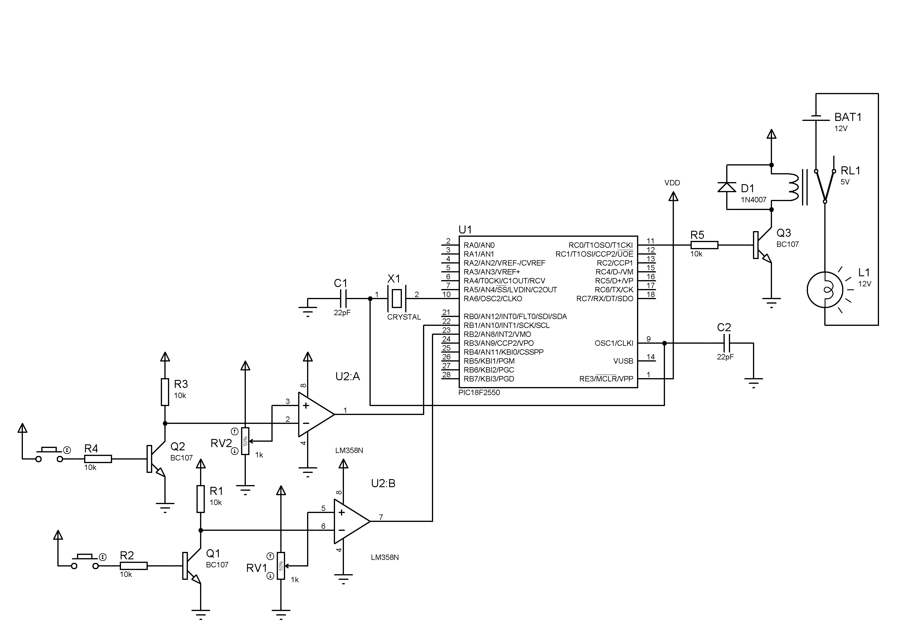

# Visitor Counter
Energy Saving using PIC 
 
# Logic
Detects the entrance and departure of people into a room and turns off the electrical equipments if there is no one in the room.
# Implementation
It is assumed that the entrance and exit are through separate doors.
A counter is initialized and it is incremented when an interrupt is generated and decremented when another interrupt is generated.
The interrupts are produced using phototransistors.
If counter = 0, the relay is turned off and if counter > 0, the relay is turned on to turn off and on the electrical equipements respectively.
